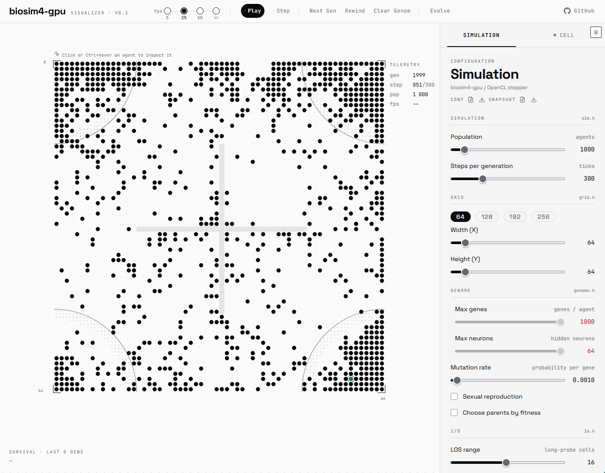

<div align="center">


# biosim4-gpu

**Evolve neural-net agents on a 2D grid.**

A GPU-accelerated port of [biosim4](https://github.com/davidrmiller/biosim4)
(David Miller's evolutionary simulator of neural-net-driven agents) to
C11/OpenCL.

[**▶ Try it live!**](https://meuna.github.io/biosim4-gpu/). Play in your browser — no install needed. 

</div>

---

<div align="center">



</div>

## What it is

**biosim4** evolves small populations of agents whose behaviour is driven by an
evolved neural network. Each generation, agents that satisfy a *challenge*
(reach a zone, avoid a barrier, cluster together…) survive and reproduce, and
the population's behaviour emerges over hundreds of generations.

There are two ways to use it:

- **Play live in the browser.** The [web app](https://meuna.github.io/biosim4-gpu/)
  runs the simulator in your browser: design a run, watch it evolve on a canvas, and
  inspect an individual agent's evolved brain.
- **Power through generations on your GPU.** Download the
  [pre-compiled binary](https://github.com/meuna/biosim4-gpu/releases/latest)
  and run the same configuration through hundreds of generations far faster than
  the browser can, with the heavy per-step work offloaded to your GPU.

The two halves connect into a round trip:

1. Configure a simulation in the web app.
2. Click  to download a `biosim.toml` file.
3. Run it on your GPU:

```sh
biosim-gpu --config=biosim.toml --snapshot-out=biosim.snap --max-gen=10000
```

4. **Drag-and-drop** the resulting `biosim.snap` back onto the web app to load
   the evolved survivors and watch where evolution took them.

## Features

- **GPU-accelerated evolution** — the per-step pipeline runs in OpenCL kernels;
  a single-threaded CPU reference simulator (`sim-ref`) mirrors it for
  correctness.
- **Browser front-end** — configure population, grid, genome, challenges and
  barriers; watch generations render live on a canvas.
- **Agent inspection** — pick any agent and explore its evolved neural network
  as an interactive force-directed graph (the *brain explorer*).
- **Round-trip with the CLI** — export a `.toml` config and a `.snap` snapshot
  from the web app and feed them straight to `biosim-gpu`; load a snapshot back
  into the web app to replay the survivors.

## Installation

### Pre-compiled binaries

The fastest way to run on your own machine is a pre-compiled binary — no
toolchain required.

1. Grab the archive for your platform from the
   [releases page](https://github.com/Meuna/biosim4-gpu/releases)
2. Extract it. You get a `bin/` folder with two executables:
   - `biosim-gpu`/`biosim-gpu.exe` — the GPU simulator
   - `biosim-ref`/`biosim-ref.exe` — a CPU reference simulator (no OpenCL,
     no GPU needed)
3. Install an OpenCL runtime. Nvidia/AMD official for Windows should come readily
   installed. See [`docs/build-opencl.md`](docs/build-opencl.md).

### Quickstart from source

See the complete build documentation: [`docs/build.md`](docs/build.md)

#### Native CLI

**Prerequisites:** CMake 3.28+, C toolchain, Ninja and vcpkg.

```sh
git clone https://github.com/Meuna/biosim4-gpu.git
cd biosim4-gpu

# Set up vcpkg (once)
git clone https://github.com/microsoft/vcpkg.git ~/vcpkg
~/vcpkg/bootstrap-vcpkg.sh
export VCPKG_ROOT=~/vcpkg

# Build
cmake --preset debug
cmake --build --preset debug

# CPU reference simulator (defaults: 3000 agents, 128×128 grid, 1000 generations)
./build/debug/packages/sim-ref/biosim-ref

# GPU simulator — feed a webapp-exported config and snapshot
./build/debug/packages/sim-gpu/biosim-gpu
```

See [`docs/usage.md`](docs/usage.md) for the full CLI reference (parameters,
challenges, barriers, OpenCL device selection).


#### Web app

**Prerequisites:** Emscripten, Bun, and the build basics above.

```sh
# Build the WASM module + start the Vite dev server
cmake --preset webapp
cmake --build --preset webapp --target dev

[1/2] Starting Vite dev server
$ vite

  VITE v6.4.2  ready in 901 ms

  ➜  Local:   http://localhost:5173/
  ➜  press h + enter to show help
```

## Motivation

The port is 100% AI-assisted, which is the main educational objective: for
better or worse, I think AI is here to stay, and I want a hands-on (or
hands-off) experience building complex software with it. The approach is
documented in the [AI-development notes](docs/ai-development.md).

The secondary motivations are also educational: GPU acceleration, and
structuring a complex C program. Hopefully the project also accelerates the
biosim4 simulator and unlocks playing with more advanced behaviours.

## Repository map

| Path | Contents |
|------|----------|
| `packages/core/` | Simulation logic (genome, nnet, agents, grid, challenges, snapshot) |
| `packages/cfgparse/` | CLI/TOML/parameter management |
| `packages/sim-ref/` | Single-threaded CPU reference simulator |
| `packages/sim-gpu/` | OpenCL GPU simulator |
| `packages/sim-wasm/` | `core` compiled to a WebAssembly module |
| `packages/webapp/` | Svelte web front-end |
| `docs/architecture.md` | Package structure, key types and functions |
| `docs/build.md` | Prerequisites, build steps, lint/format targets |
| `docs/usage.md` | CLI reference, TOML format, challenges, barriers |
| `docs/gpu-design.md` | GPU kernel pipeline design |
| `docs/formats.md` | Snapshot binary format, TOML format overview |
| `STATUS.md` | Implementation status, missing parts, open design questions |

## License

MIT.
